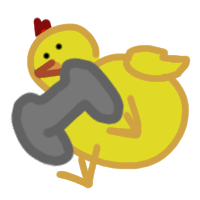
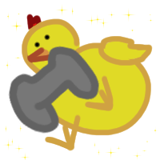

# Piou Piou Gaming 




<!-- Version en Francais -->
<details>
<summary> 🇬🇧 English version</summary>

### <u>Summary</u> : 
<a href="#Description"> Description and Organization</a> <br>
<a href="#Install"> Install the project </a> <br>
<a href="#Thanks"> Special Thanks </a> <br>


## <div id="Description">Description and Organization</div>

This project is a `website` designed for people who want to discover the world of `video games` or explore a `new genre`.

We had to create a website as a group on a topic of our choice in order to develop our teamwork skills, project management, and experience sharing a GitHub repository, etc.

For the organization of the project, we used Trello for task management and Figma for UI design.

### Collaborator

- <u> Hien</u> : index and page genre
- <u> Laurent</u> : navbar, footer and page retro
- <u> Linda</u> : page discover
- <u> Sammy</u> : page technologie
- <u> Ulrich</u> : page pegi
- <u> Solene</u> : page art


### Date

Launch date : `11/03/2026` <br>
First submission date : `13/03/2026` <br>
Final submission date : `20/03/2026` <br>

### Link

<a href="https://www.figma.com/design/x5i3oZx9doG3hcC6Cjeq0A/Untitled?node-id=0-1&t=HyUqJQea2wShScya-1">`Figma link`</a> <br>
<a href="https://trello.com/w/wildcodeschoolproject1/home">`Trello link`</a> 

## <div id="Install">Install the project</div>

### Install
```
git clone git@github.com:SoleneMend/Project1_WildGaming.git
```
<i>Then open index.html in your web browser</i>

## <div id="Thanks">Special Thanks</div>

Special Thanks to wooloo !

</details>


<!-- Version en Francais -->
<details open>
<summary> 🇫🇷 Version française</summary>

### <u>Sommaire</u> : 
<a href="#Description"> Description</a> <br>
<a href="#Organisation"> Organisation et collaborateur</a> <br>
<a href="#Installer"> Installer/ Executer le projet </a> <br>
<a href="#Remerciment"> Remerciment </a> <br>


## <div id="Description">Description et organisation</div>

Ce projet est un `site web` pensé pour les personnes voulant découvrir le monde du `jeu vidéo` ou découvrir un nouveau genre.

Nous devions réaliser un site web en groupe sur le sujet de notre choix afin de travailler notre esprit d'équipe, notre gestion de projet, ainsi que le partage d'un repository GitHub, etc.

Pour l’organisation du projet, nous avons utilisé Trello pour la gestion des tâches et Figma pour la conception des interfaces.

### Collaborateur

- <u> Hien</u> : page genre et index
- <u> Laurent</u> : page retro, navbar et footer
- <u> Linda</u> : page découverte
- <u> Sammy</u> : page technologie
- <u> Ulrich</u> : page pegi
- <u> Solene</u> : page art


### Date du projet

Date du lancement : `11/03/2026` <br>
Date du 1er rendu : `13/03/2026` <br>
Date de rendu final : `20/03/2026` <br>

### Lien du projet

<a href="https://www.figma.com/design/x5i3oZx9doG3hcC6Cjeq0A/Untitled?node-id=0-1&t=HyUqJQea2wShScya-1">`lien du Figma`</a> <br>
<a href="https://trello.com/w/wildcodeschoolproject1/home">`lien du Trello`</a> 

## <div id="Installer">Installer le projet</div>

### Installation
```
git clone git@github.com:SoleneMend/Project1_WildGaming.git
```
<i>Puis ouvrir la page index.html dans votre navigateur</i>

## <div id="Remerciment">Remerciment</div>

Grand remerciment à moumouton!
</details>

